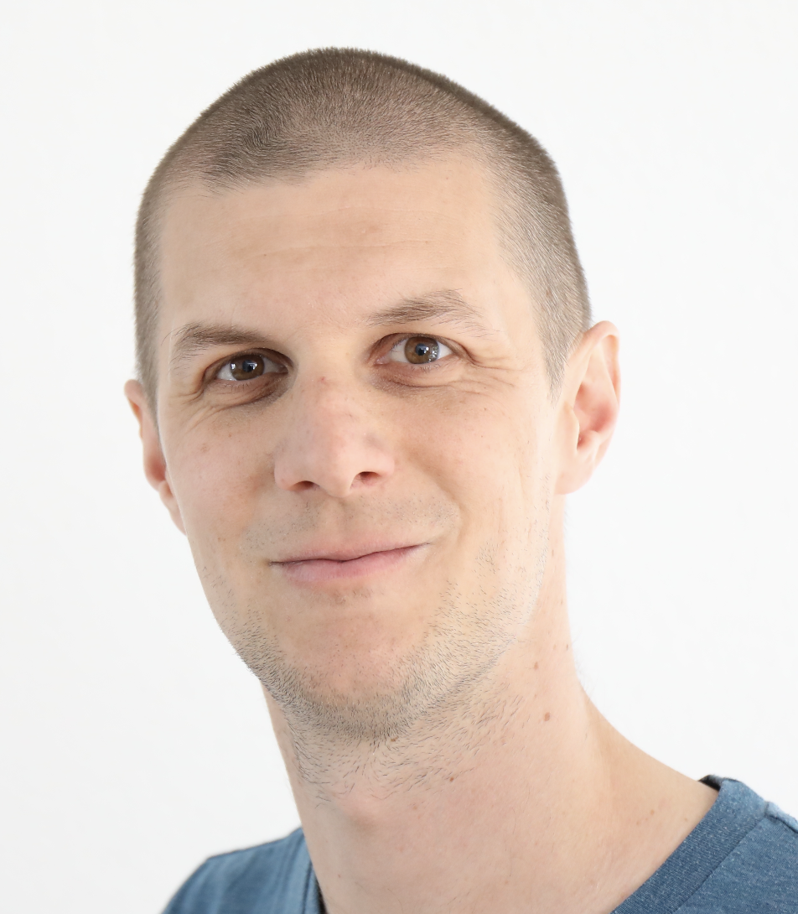

```{r setup, include=FALSE}
knitr::opts_chunk$set(echo = FALSE)
```

```{r,echo=FALSE, out.width="40%"}

```


I am a collaborator in a National Science Foundation (SNSF) funded National Research Program (NRP 77) and was a co-chair for the 2021 edition of useR!, the annual  conference of the R Project for Statistical Computing. I continue to work in a global 
useR! working group to help a broad variety of R users around the world attend future useR! events. 

Also, I am 1/2 of [banboo data](https://buymeacoffee.com/banboodata), an open source collaboration with @[jburkahrdt](https://github.com/jburkardt) to help website owners analyze their data with open source software. 


